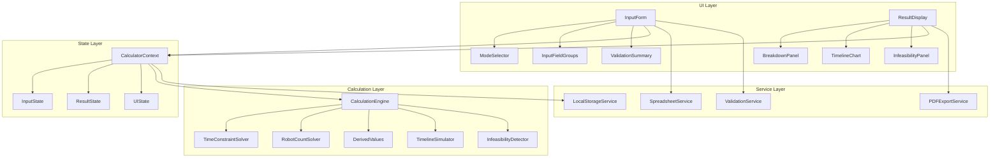
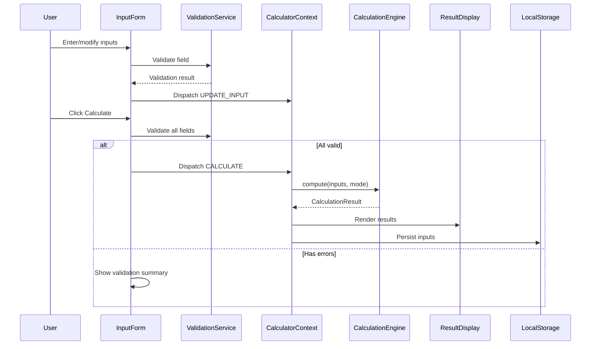

# Design Document: Cleaning Robot Fleet Calculator

## Overview

A client-side single-page web application that calculates cleaning robot fleet requirements. The application operates in two modes: determining the number of robots needed for a time constraint, or computing the total time for a given fleet size. It accounts for workload coverage, infrastructure constraints, performance characteristics, transition overhead, and logistical multipliers.

The application is entirely client-side with no backend. All computation, PDF generation, and spreadsheet parsing happen in the browser.

### Tech Stack

| Layer | Choice | Rationale |
|-------|--------|-----------|
| Language | TypeScript | Type safety for complex calculation logic |
| Framework | React 18 | Component-based UI, large ecosystem |
| Build | Vite | Fast HMR, modern bundling |
| Styling | CSS Modules | Scoped styles, no runtime overhead |
| State | React Context + useReducer | Sufficient for single-page app with ~25 input fields |
| PDF | jsPDF + jspdf-autotable | Client-side PDF generation, A4 layout support |
| Spreadsheet | SheetJS (xlsx) | Industry-standard browser-based CSV/XLSX parsing |
| Charting | Custom SVG | Gantt-style timeline and dual-axis efficiency graph are too specialized for generic chart libs |
| Testing | Vitest + fast-check | Fast test runner with property-based testing support |
| Validation | Zod | Schema-based validation with TypeScript inference |

## Architecture

The application follows a layered architecture separating concerns into distinct modules:



### Data Flow



## Components and Interfaces

### Component Tree

```
App
├── Header
├── ModeSelector
├── InputForm
│   ├── ValidationSummary
│   ├── WorkloadSection
│   │   └── InputField (×4)
│   ├── FleetSection
│   │   └── InputField (×7)
│   ├── PerformanceSection
│   │   └── InputField (×4)
│   ├── TimeTransitionSection
│   │   ├── InputField (×4)
│   │   └── DerivedField (×4: travel_time, charging_contention, refill_contention)
│   ├── LogisticalSection
│   │   ├── InputField (×1)
│   │   └── DerivedField (×2: recharge_cycles, refill_cycles)
│   ├── StartModeToggle
│   ├── WorkAssignmentModeToggle
│   ├── CommentsField
│   ├── SpreadsheetUpload
│   └── ActionButtons (Calculate, Reset, Use All Defaults, Download Template)
├── ResultDisplay
│   ├── PrimaryResult
│   ├── BreakdownPanel
│   │   ├── StepByStepBreakdown
│   │   └── PercentageContributions
│   ├── OptimizationOpportunities
│   ├── TimelineChart (Gantt SVG)
│   │   └── ChartLegend (placed outside chart area)
│   ├── EfficiencyGraph (dual-axis line chart, shares x-axis with TimelineChart)
│   │   └── EfficiencyLegend
│   ├── InfeasibilityPanel (conditional)
│   └── ExportButton
└── Footer
```

### Key Interfaces

```typescript
// Calculation mode
type CalculationMode = 'time-constraint' | 'robot-count';

// Start mode for timeline chart
type StartMode = 'simultaneous' | 'staggered';

// Work assignment mode
type WorkAssignmentMode = 'fixed-zones' | 'collaborative';

// All user-editable inputs
interface CalculatorInputs {
  mode: CalculationMode;
  startMode: StartMode;
  work_assignment_mode: WorkAssignmentMode;
  // Workload
  actual_area_per_floor: number;
  num_of_passes: number;
  overlap_percentage: number;
  effective_cleaning_width: number;
  // Fleet
  num_of_robots: number; // used in Robot Count mode
  time_constraint: number; // used in Time Constraint mode
  num_of_charging_points: number;
  num_of_refill_stations: number;
  num_of_floors: number;
  num_of_robots_per_elevator_trip: number;
  num_of_elevators: number;
  service_hub_on_different_floor: boolean;
  // Performance
  effective_speed: number;
  total_battery_life: number;
  battery_reserve_threshold: number;
  tank_capacity_time: number;
  // Time & Transitions
  distance_to_service_hub: number;
  vertical_travel_time: number;
  effective_charge_time: number;
  refill_duration: number;
  // Logistical
  field_buffer_multiplier: number;
  // Meta
  comments: string;
}

// Derived values computed from inputs
interface DerivedValues {
  travel_time_to_service_hub: number;
  charging_contention_time: number;
  refill_contention_time: number;
  num_of_recharge_cycles: number;
  num_of_refill_cycles: number;
  total_cleaning_distance: number;
  usable_battery_time: number;
  cleaning_time_per_robot: number;
  service_hub_floor_penalty: number;
}

// Result of a calculation
interface CalculationResult {
  mode: CalculationMode;
  // Primary result
  num_of_robots: number; // computed in time-constraint mode
  total_elapsed_time: number; // computed in robot-count mode (or for display)
  // Breakdown
  cleaning_time_per_robot: number;
  recharge_downtime_total: number;
  refill_downtime_total: number;
  initial_floor_distribution_time: number;
  field_buffer_impact: number;
  // Derived
  derived: DerivedValues;
  // Percentage contributions
  contributions: TimeContributions;
  // Optimization opportunities (top 3)
  optimizations: OptimizationSuggestion[];
  // Timeline data
  timeline: RobotTimeline[];
  // Efficiency data (sampled at each state transition in the simulation)
  efficiencyData: EfficiencyDataPoint[];
  // Infeasibility
  infeasible: boolean;
  infeasibilityReason?: string;
  infeasibilitySuggestions?: string[];
}

interface TimeContributions {
  active_cleaning_pct: number;
  charging_overhead_pct: number;
  refill_overhead_pct: number;
  travel_overhead_pct: number;
  floor_distribution_pct: number;
  field_buffer_pct: number;
}

interface OptimizationSuggestion {
  variable: string;
  label: string;
  contribution_minutes: number;
  suggestion: string;
}

// Timeline chart data
type ActivityType =
  | 'cleaning'
  | 'traveling'
  | 'charging'
  | 'waiting-charge'
  | 'refilling'
  | 'waiting-refill'
  | 'elevator'
  | 'idle';

interface TimelineSegment {
  activity: ActivityType;
  start: number; // minutes from t=0
  end: number;   // minutes from t=0
  robotIndex: number;
}

interface RobotTimeline {
  robotIndex: number;
  segments: TimelineSegment[];
}

// Efficiency graph data point (sampled at each state transition)
interface EfficiencyDataPoint {
  time: number; // minutes from t=0
  fleet_utilization_pct: number; // 0-100: (robots_currently_cleaning / num_of_robots) × 100
  cumulative_progress_pct: number; // 0-100: (distance_cleaned_so_far / total_cleaning_distance) × 100
}

// Validation
interface ValidationError {
  field: string;
  message: string;
}

interface ValidationResult {
  valid: boolean;
  errors: ValidationError[];
}
```

### CalculationEngine Interface

```typescript
interface ICalculationEngine {
  // Main entry point
  compute(inputs: CalculatorInputs): CalculationResult;

  // Sub-computations (exposed for testing)
  computeTotalCleaningDistance(inputs: CalculatorInputs): number;
  computeUsableBatteryTime(inputs: CalculatorInputs): number;
  computeCleaningTimePerRobot(totalDistance: number, speed: number, numRobots: number): number;
  computeRechargeCycles(cleaningTime: number, usableBatteryTime: number): number;
  computeRefillCycles(cleaningTime: number, tankCapacityTime: number): number;
  computeChargingContention(numRobots: number, numDocks: number, chargeTime: number): number;
  computeRefillContention(numRobots: number, numStations: number, refillDuration: number): number;
  computeFloorDistributionTime(inputs: CalculatorInputs): number;

  // Simulation-based total elapsed time (source of truth)
  // Runs the timeline simulation and returns the completion time × field_buffer_multiplier
  computeTotalElapsedTime(inputs: CalculatorInputs, numRobots: number): number;

  // Mode-specific solvers (both use simulation internally)
  solveTimeConstraint(inputs: CalculatorInputs): CalculationResult;
  solveRobotCount(inputs: CalculatorInputs): CalculationResult;

  // Timeline simulation (produces the Gantt chart data AND drives the elapsed time result)
  // Respects inputs.work_assignment_mode: 'fixed-zones' assigns each robot a fixed share,
  // 'collaborative' uses a shared work pool
  // Also produces efficiency data points sampled at each state transition
  simulateTimeline(inputs: CalculatorInputs, numRobots: number, startMode: StartMode): { timelines: RobotTimeline[], efficiencyData: EfficiencyDataPoint[] };

  // Extract approximate breakdown from simulation timeline data (for explanatory display)
  extractBreakdownFromTimeline(timelines: RobotTimeline[], numRobots: number, fieldBufferMultiplier: number): TimeContributions;

  // Infeasibility detection
  detectInfeasibility(inputs: CalculatorInputs): InfeasibilityResult | null;
}

interface InfeasibilityResult {
  reason: string;
  bindingConstraints: string[];
  suggestions: string[];
}
```

## Data Models

### State Management

```typescript
// Actions for the reducer
type CalculatorAction =
  | { type: 'UPDATE_INPUT'; field: keyof CalculatorInputs; value: any }
  | { type: 'SET_MODE'; mode: CalculationMode }
  | { type: 'SET_START_MODE'; startMode: StartMode }
  | { type: 'SET_WORK_ASSIGNMENT_MODE'; workAssignmentMode: WorkAssignmentMode }
  | { type: 'CALCULATE' }
  | { type: 'RESET' }
  | { type: 'LOAD_FROM_STORAGE'; inputs: Partial<CalculatorInputs> }
  | { type: 'LOAD_FROM_SPREADSHEET'; inputs: Partial<CalculatorInputs> }
  | { type: 'SET_VALIDATION_ERRORS'; errors: ValidationError[] }
  | { type: 'CLEAR_VALIDATION_ERROR'; field: string };

interface CalculatorState {
  inputs: CalculatorInputs;
  derived: DerivedValues | null;
  result: CalculationResult | null;
  validationErrors: ValidationError[];
  isCalculating: boolean;
  hasCustomizedFields: Set<string>; // tracks which fields user has modified from defaults
}
```

### Default Values

```typescript
const DEFAULT_INPUTS: CalculatorInputs = {
  mode: 'time-constraint',
  startMode: 'simultaneous',
  work_assignment_mode: 'fixed-zones',
  actual_area_per_floor: 500,
  num_of_passes: 1,
  overlap_percentage: 0.10,
  effective_cleaning_width: 0.30,
  num_of_robots: 3,
  time_constraint: 480, // 8 hours
  num_of_charging_points: 2,
  num_of_refill_stations: 1,
  num_of_floors: 1,
  num_of_robots_per_elevator_trip: 1,
  num_of_elevators: 1,
  service_hub_on_different_floor: false,
  effective_speed: 18,
  total_battery_life: 120,
  battery_reserve_threshold: 0.20,
  tank_capacity_time: 60,
  distance_to_service_hub: Math.sqrt(500 / Math.PI), // ≈ 12.62
  vertical_travel_time: 5,
  effective_charge_time: 90,
  refill_duration: 5,
  field_buffer_multiplier: 1.20,
  comments: '',
};
```

### LocalStorage Schema

```typescript
// Key: 'cleaning-robot-fleet-calculator-inputs'
// Value: JSON-serialized CalculatorInputs + metadata
interface StoredData {
  version: 1;
  inputs: CalculatorInputs;
  savedAt: string; // ISO timestamp
}
```

### Spreadsheet Format

Expected two-column format for upload:

| Variable | Value |
|----------|-------|
| actual_area_per_floor | 500 |
| num_of_passes | 1 |
| overlap_percentage | 0.10 |
| ... | ... |

### Validation Schema (Zod)

```typescript
const calculatorSchema = z.object({
  actual_area_per_floor: z.number().positive("must be a positive number"),
  num_of_passes: z.number().int().min(1, "must be a positive integer"),
  overlap_percentage: z.number().gt(0).lt(1, "must be between 0 and 1 exclusive"),
  effective_cleaning_width: z.number().positive("must be a positive number"),
  num_of_robots: z.number().int().min(1, "must be a positive integer"),
  time_constraint: z.number().positive("must be a positive number"),
  num_of_charging_points: z.number().int().min(1, "must be a positive integer"),
  num_of_refill_stations: z.number().int().min(1, "must be a positive integer"),
  num_of_floors: z.number().int().min(1, "must be a positive integer"),
  num_of_robots_per_elevator_trip: z.number().int().min(1, "must be a positive integer"),
  num_of_elevators: z.number().int().min(1, "must be a positive integer"),
  effective_speed: z.number().positive("must be a positive number"),
  total_battery_life: z.number().positive("must be a positive number"),
  battery_reserve_threshold: z.number().gt(0).lt(1, "must be between 0 and 1 exclusive"),
  tank_capacity_time: z.number().positive("must be a positive number"),
  distance_to_service_hub: z.number().positive("must be a positive number"),
  vertical_travel_time: z.number().min(0, "must be zero or positive"),
  effective_charge_time: z.number().min(0, "must be zero or positive"),
  refill_duration: z.number().min(0, "must be zero or positive"),
  field_buffer_multiplier: z.number().min(1.0, "must be 1.0 or greater"),
});
```

### Key Algorithms

#### Time Constraint Mode Iterative Solver

```
function solveTimeConstraint(inputs):
  maxRobots = 1000  // safety cap
  for numRobots = 1 to maxRobots:
    elapsed = computeTotalElapsedTime(inputs, numRobots)
    if elapsed <= inputs.time_constraint:
      return numRobots
  return INFEASIBLE
```

The iterative approach is necessary because `num_of_robots` affects contention times (charging and refill), which in turn affect total elapsed time. This creates a circular dependency that cannot be solved algebraically. Each iteration runs the full timeline simulation for the candidate num_of_robots.

#### Total Elapsed Time Computation (Simulation-Based)

The total elapsed time is determined by the discrete-event timeline simulation, NOT by an aggregate formula. The simulation is the source of truth.

```
function computeTotalElapsedTime(inputs, numRobots):
  // Run the timeline simulation for the current start mode
  timelines = simulateTimeline(inputs, numRobots, inputs.startMode)

  // The raw elapsed time is the completion time of the last robot
  // (the rightmost point on the Gantt chart)
  rawElapsedTime = max(timeline.segments.last().end for timeline in timelines)

  // Apply field buffer as a final multiplier
  return rawElapsedTime × field_buffer_multiplier
```

**Why simulation over formula?** The aggregate formula `(cleaning_time + recharge_downtime + refill_downtime + floor_distribution) × buffer` is an approximation that assumes a constant cleaning rate across the entire job. This is incorrect — the effective fleet cleaning rate is dynamic, varying over time as robots cycle through service stops. For example, with 3 robots and 1 refill station (simultaneous start, collaborative mode): at t=0–60 all 3 robots clean (rate = 3× effective_speed), at t=60–67.8 all robots are servicing (rate = 0×), at t=67.8–72.8 only Robot 1 cleans (rate = 1×), at t=72.8–77.8 Robots 1 & 2 clean (rate = 2×), and at t=77.8–81.4 all 3 resume (rate = 3×). The formula cannot capture these fluctuations. The simulation models each robot's state transitions and tracks exactly how many robots are actively cleaning at every moment, producing the correct dynamic drain rate on the work pool.

#### Approximate Breakdown (Explanatory Only)

The following formula-based values are retained for the explanatory breakdown display. They show approximate contributions but are NOT the source of truth for total_elapsed_time:

```
function computeApproximateBreakdown(inputs, numRobots, timelines):
  // These values are derived from aggregating simulation timeline segments
  // by activity type across all robots, then dividing by numRobots to get
  // a per-robot average contribution

  totalCleaningDistance = (actual_area_per_floor × num_of_floors) × num_of_passes
                         / (effective_cleaning_width × (1 - overlap_percentage))

  usableBatteryTime = total_battery_life × (1 - battery_reserve_threshold)
  cleaningTimePerRobot = totalCleaningDistance / (effective_speed × numRobots)

  rechargeCycles = max(0, ceil(cleaningTimePerRobot / usableBatteryTime) - 1)
  refillCycles = max(0, ceil(cleaningTimePerRobot / tank_capacity_time) - 1)

  travelTime = (2 × distance_to_service_hub) / effective_speed
  floorPenalty = service_hub_on_different_floor ? vertical_travel_time : 0

  floorDistribution = ceil(numRobots / (num_of_robots_per_elevator_trip × num_of_elevators))
                      × vertical_travel_time × (num_of_floors - 1)

  // Actual time contributions are extracted from the simulation timeline data:
  // - Sum all 'cleaning' segment durations across robots → total cleaning time
  // - Sum all 'charging' segment durations → total charging time
  // - Sum all 'waiting-charge' + 'waiting-refill' → total contention time
  // - etc.
  // These are divided by numRobots for per-robot averages shown in the breakdown
```

#### Timeline Simulation (Source of Truth for Elapsed Time)

The timeline simulation is the primary computation that determines total_elapsed_time. It models each robot's schedule as a sequence of activities, tracking shared resource availability (docks, stations) to produce realistic contention.

The simulation supports two work assignment modes:
- **Fixed Zones**: Each robot is assigned `cleaningTimePerRobot = totalCleaningDistance / (effectiveSpeed × numRobots)` of work upfront. A robot that finishes its share sits idle.
- **Collaborative**: A shared work pool of `totalCleaningDistance` metres is maintained. ALL currently-cleaning robots drain the pool simultaneously at the combined rate. When a robot returns from a service stop, it checks the pool and continues if work remains. The job completes when the pool reaches 0.

#### Determinism

The simulation is fully deterministic. Given identical inputs, it produces byte-identical results on every execution. No randomness or non-deterministic data structures (e.g., hash maps with random iteration order) are used. When multiple robots reach an event at the same time, they are processed in robot ID order (lowest first). This ensures identical results across executions.

#### Event-Driven Concurrent Drain Model

The simulation uses an event-driven approach where ALL currently-cleaning robots drain the pool (or their individual battery/tank) simultaneously at the combined rate. A robot must NOT pre-claim its entire next cleaning segment from the pool. Instead:

1. The simulation maintains a priority queue of upcoming events (battery empty, tank empty, pool empty, service complete, robot starts cleaning).
2. Between events, all robots in the "cleaning" state drain the shared pool at `num_cleaning_robots × effective_speed` simultaneously. Each cleaning robot's battery and tank also drain at `1 × effective_speed` (in distance terms) or 1 min/min (in time terms).
3. At each event, the simulation processes state transitions (robot leaves cleaning → enters service, robot finishes service → resumes cleaning, pool reaches 0 → job done).
4. When a new robot enters the cleaning state, the combined drain rate increases. When a robot leaves, it decreases.

This correctly models the R1/R2 imbalance in collaborative mode: R1 gets first access to the refill station (no wait), R2 waits for R1 to finish, so R2 spends less time cleaning and contributes less to the pool drain.

```
function simulateTimeline(inputs, numRobots, startMode):
  // Initialize state for each robot
  robots = []
  for i in 0..numRobots-1:
    robots[i] = {
      state: 'pending',  // pending | cleaning | traveling | charging | waiting-charge |
                         //           refilling | waiting-refill | idle | done
      batteryRemaining: usableBatteryTime,
      tankRemaining: tank_capacity_time,
      startTime: startOffset(i, startMode),
      segments: [],
      cleaningStartTime: null,  // when current cleaning segment began
      distanceCleaned: 0,       // total distance this robot has cleaned (for work distribution tracking)
    }

  // Shared resources
  dockFreeAt = [0] × num_of_charging_points   // time each dock becomes free
  stationFreeAt = [0] × num_of_refill_stations // time each station becomes free

  // Work pool (Collaborative mode)
  if inputs.work_assignment_mode == 'collaborative':
    sharedRemainingDistance = totalCleaningDistance
  else:
    // Fixed Zones: each robot has its own remaining distance
    for each robot: robot.remainingDistance = totalCleaningDistance / numRobots

  // Event-driven simulation loop
  eventQueue = PriorityQueue()  // (time, robotId, eventType)

  // Seed initial events: each robot starts cleaning at its start time
  for i in 0..numRobots-1:
    eventQueue.push(robots[i].startTime, i, 'start-cleaning')

  currentTime = 0

  while eventQueue is not empty:
    (eventTime, robotId, eventType) = eventQueue.pop()

    // CRITICAL: Between currentTime and eventTime, all cleaning robots
    // have been draining the pool simultaneously.
    // Update the pool/battery/tank for the elapsed interval.
    elapsed = eventTime - currentTime
    if elapsed > 0:
      cleaningRobots = [r for r in robots if r.state == 'cleaning']
      numCleaning = len(cleaningRobots)
      if numCleaning > 0:
        distanceDrained = elapsed × numCleaning × effective_speed
        if inputs.work_assignment_mode == 'collaborative':
          sharedRemainingDistance -= distanceDrained
          // Each cleaning robot gets equal share of the drain
          perRobotDistance = elapsed × effective_speed
          for r in cleaningRobots:
            r.batteryRemaining -= elapsed
            r.tankRemaining -= elapsed
            r.distanceCleaned += perRobotDistance
        else:
          for r in cleaningRobots:
            perRobotDistance = elapsed × effective_speed
            r.remainingDistance -= perRobotDistance
            r.batteryRemaining -= elapsed
            r.tankRemaining -= elapsed
            r.distanceCleaned += perRobotDistance

    currentTime = eventTime

    // Process the event (deterministic tie-breaking: lowest robotId first)
    switch eventType:
      case 'start-cleaning':
        robot = robots[robotId]
        robot.state = 'cleaning'
        robot.cleaningStartTime = currentTime
        // Schedule next event: min(battery empty, tank empty, work done)
        scheduleNextCleaningEvent(robot, robotId, eventQueue)

      case 'battery-empty':
        robot = robots[robotId]
        // End cleaning segment
        robot.segments.push(cleaning, robot.cleaningStartTime, currentTime)
        robot.state = 'traveling'
        // Travel to service hub
        travelEnd = currentTime + travelTimeToServiceHub
        robot.segments.push(traveling, currentTime, travelEnd)
        // Find earliest available dock (deterministic: pick lowest-index dock on tie)
        (dockIdx, availableAt) = findEarliestDock(dockFreeAt)
        waitStart = travelEnd
        chargeStart = max(travelEnd, availableAt)
        if chargeStart > waitStart:
          robot.segments.push(waiting-charge, waitStart, chargeStart)
        chargeEnd = chargeStart + effective_charge_time
        dockFreeAt[dockIdx] = chargeEnd
        robot.segments.push(charging, chargeStart, chargeEnd)
        robot.batteryRemaining = usableBatteryTime
        // Travel back
        returnEnd = chargeEnd + travelTimeToServiceHub
        robot.segments.push(traveling, chargeEnd, returnEnd)
        // Resume cleaning (if work remains)
        eventQueue.push(returnEnd, robotId, 'resume-after-service')

      case 'tank-empty':
        // Similar to battery-empty but uses refill stations
        robot = robots[robotId]
        robot.segments.push(cleaning, robot.cleaningStartTime, currentTime)
        robot.state = 'traveling'
        travelEnd = currentTime + travelTimeToServiceHub
        robot.segments.push(traveling, currentTime, travelEnd)
        (stationIdx, availableAt) = findEarliestStation(stationFreeAt)
        waitStart = travelEnd
        refillStart = max(travelEnd, availableAt)
        if refillStart > waitStart:
          robot.segments.push(waiting-refill, waitStart, refillStart)
        refillEnd = refillStart + refill_duration
        stationFreeAt[stationIdx] = refillEnd
        robot.segments.push(refilling, refillStart, refillEnd)
        robot.tankRemaining = tank_capacity_time
        returnEnd = refillEnd + travelTimeToServiceHub
        robot.segments.push(traveling, refillEnd, returnEnd)
        eventQueue.push(returnEnd, robotId, 'resume-after-service')

      case 'work-done':
        robot = robots[robotId]
        robot.segments.push(cleaning, robot.cleaningStartTime, currentTime)
        robot.state = 'done'

      case 'resume-after-service':
        robot = robots[robotId]
        // Check if work remains
        workRemains = (inputs.work_assignment_mode == 'collaborative')
                      ? sharedRemainingDistance > 0
                      : robot.remainingDistance > 0
        if workRemains:
          robot.state = 'cleaning'
          robot.cleaningStartTime = currentTime
          scheduleNextCleaningEvent(robot, robotId, eventQueue)
        else:
          robot.state = 'idle'

      case 'pool-empty':
        // All cleaning robots stop; end their cleaning segments
        for r in robots where r.state == 'cleaning':
          r.segments.push(cleaning, r.cleaningStartTime, currentTime)
          r.state = 'done'

  // Pad with idle segments so all robots end at the same time
  maxEndTime = max(last segment end for each robot)
  for each robot with last segment end < maxEndTime:
    robot.segments.push(idle, lastEnd, maxEndTime)

  return { timelines: robots.map(r => r.segments), efficiencyData }

function scheduleNextCleaningEvent(robot, robotId, eventQueue):
  // Determine when this robot will next need to stop cleaning
  // The event time depends on how many robots are currently cleaning
  // (which affects pool drain rate in collaborative mode)
  timeToBatteryEmpty = robot.batteryRemaining
  timeToTankEmpty = robot.tankRemaining

  if inputs.work_assignment_mode == 'collaborative':
    // Pool drain rate = numCurrentlyCleaning × effective_speed
    // Time until pool empty = sharedRemainingDistance / (numCleaning × effective_speed)
    numCleaning = count(robots where state == 'cleaning')
    timeToPoolEmpty = sharedRemainingDistance / (numCleaning × effective_speed)
    nextEventTime = currentTime + min(timeToBatteryEmpty, timeToTankEmpty, timeToPoolEmpty)
    if min is timeToPoolEmpty:
      eventQueue.push(nextEventTime, robotId, 'pool-empty')
    elif min is timeToBatteryEmpty:
      eventQueue.push(nextEventTime, robotId, 'battery-empty')
    else:
      eventQueue.push(nextEventTime, robotId, 'tank-empty')
  else:
    timeToWorkDone = robot.remainingDistance / effective_speed
    nextEventTime = currentTime + min(timeToBatteryEmpty, timeToTankEmpty, timeToWorkDone)
    if min is timeToWorkDone:
      eventQueue.push(nextEventTime, robotId, 'work-done')
    elif min is timeToBatteryEmpty:
      eventQueue.push(nextEventTime, robotId, 'battery-empty')
    else:
      eventQueue.push(nextEventTime, robotId, 'tank-empty')

  // IMPORTANT: When the number of cleaning robots changes (a robot enters or
  // leaves cleaning state), previously scheduled 'pool-empty' events must be
  // recalculated since the drain rate has changed. Cancel stale pool-empty
  // events and reschedule based on the new rate.
```

**Efficiency Data Production**: The timeline simulation also produces efficiency data points (`EfficiencyDataPoint[]`) sampled at each state transition — whenever a robot starts or stops cleaning (including the initial transition when robots first begin cleaning after floor distribution). At each transition point, the simulation records:
- `time`: the current simulation time in minutes
- `fleet_utilization_pct`: `(number_of_robots_currently_in_cleaning_state / num_of_robots) × 100`
- `cumulative_progress_pct`: `(total_distance_cleaned_so_far / total_cleaning_distance) × 100`

This data drives the efficiency line graph rendered below the Gantt chart. The efficiency graph uses custom SVG (same approach as the Gantt chart) with dual y-axes: left axis for fleet utilization %, right axis for cumulative progress %. The Fleet Utilization line SHALL be rendered as a step function (H/V SVG commands) since it represents a discrete state metric. The Cumulative Progress line uses linear interpolation (L commands) since progress is continuous.

**Chart Rendering Notes**:
- X-axis ticks on both the Gantt chart and efficiency graph use a "nice number" algorithm to produce human-readable round intervals (e.g., 10, 20, 50, 100 min) rather than dividing total time by a fixed count
- Each tick has a small vertical mark on the x-axis for readability
- An explanatory note is displayed above the charts when raw simulation time differs from the reported elapsed time (due to field buffer multiplier)
- Both charts are captured as PNG images and included in the PDF export with colour-coded legends

**Floor Distribution Model**: Robots are delivered incrementally by elevator batches. Each robot's delivery time = `ceil((robotIndex+1) / batchSize) × verticalTravelTime × (numFloors - 1)`. Earlier batches begin cleaning before later batches are delivered. The simulation starts at `currentTime = 0` and robots transition from 'pending' to 'cleaning' as their delivery time arrives.

**Note on Collaborative mode**: Because robots share a work pool, a robot that finishes a service stop (charging/refilling) checks the pool for remaining work. If Robot 1 finishes its portion while Robot 3 is still charging, Robot 1 takes over some of Robot 3's remaining work. This eliminates idle time and always produces equal or shorter elapsed time compared to Fixed Zones mode.

#### Validated Reference Scenario

The following table documents the expected simulation outputs for a specific scenario that has been manually validated. It serves as a regression test target for the simulation implementation.

**Reference Scenario Parameters**: 3 robots, 2 charging docks, 1 refill station, 2000 m², battery 96 min usable, tank 60 min, charge time 90 min, refill 5 min, travel 1.4 min, buffer 1.20

| Scenario | Raw Time | Buffered | Dead Time | Active Time | % Active | R1/R2/R3 Work Split |
|----------|----------|----------|-----------|-------------|----------|---------------------|
| Simultaneous + Fixed Zones | 335.6 min | 402.7 min | 137.3 min | 198.3 min | 59.1% | 33.3% / 33.3% / 33.3% |
| Simultaneous + Collaborative | 268.7 min | 322.4 min | 93.4 min | 175.3 min | 65.2% | 38.9% / 37.7% / 23.3% |
| Staggered + Fixed Zones | 335.6 min | 402.7 min | 79.4 min | 256.2 min | 76.3% | 33.3% / 33.3% / 33.3% |
| Staggered + Collaborative | 277.5 min | 333.0 min | 47.6 min | 229.9 min | 82.8% | 41.1% / 35.6% / 23.3% |

**Key observations:**
- "Fastest total time" (Simultaneous + Collaborative, 268.7 min) and "highest utilization" (Staggered + Collaborative, 82.8%) are DIFFERENT optimization targets
- Simultaneous + Collaborative has a large dead period (82.8 min, t=113.9–196.7) where all 3 robots are in service (2 charging, 1 waiting for dock) — nobody is cleaning
- Staggered start reduces this overlap by offsetting when robots need service, resulting in only 47.6 min of dead time
- The R1/R2 imbalance in collaborative mode (38.9% vs 37.7%) is caused by R1 getting first access to the single refill station each time (R2 waits 5 min)
- R3's lower share (23.3%) is caused by waiting 80 min for a charging dock (both docks occupied by R1 and R2)

#### Design Considerations: "Fastest" ≠ "Most Active"

**1. "Fastest total time" and "highest fleet utilization" are different metrics.**

The app must display BOTH so the user can make an informed choice. The reference scenario demonstrates this clearly: Simultaneous + Collaborative finishes fastest (268.7 min raw) but has only 65.2% utilization, while Staggered + Collaborative takes longer (277.5 min raw) but achieves 82.8% utilization. A user optimizing for "finish before a deadline" wants the former; a user optimizing for "maximize robot productivity" or "minimize wasted lease time" wants the latter.

**2. Simultaneous start creates "service storms."**

When all robots start at t=0 with identical battery and tank capacities, they all deplete resources at approximately the same time. This creates a "charging storm" — a period where all robots need docks simultaneously, resulting in long dead periods where nobody cleans. In the reference scenario, this manifests as a 82.8-minute dead period (t=113.9–196.7) where all 3 robots are in service. This is a known characteristic of simultaneous start, not a bug.

**3. The efficiency graph (fleet utilization % over time) is the key tool for identifying service storms.**

When the utilization line drops to 0%, that's a service storm. The graph makes these dead periods visually obvious, helping users understand why staggered start might be preferable even if it doesn't produce the absolute shortest elapsed time.

**4. The Result_Display should highlight dead time.**

Total dead time (sum of all periods where zero robots are actively cleaning) is displayed as a metric alongside total elapsed time. This helps users identify service storm bottlenecks and understand the trade-off between start modes. The efficiency graph's 0% utilization periods correspond directly to these service storms.

#### Infeasibility Detection

The solver detects infeasibility when:
1. Even with `maxRobots` (1000), the time constraint cannot be met
2. The minimum single-robot cycle time (one cleaning segment + one charge + one refill) exceeds the time constraint
3. Elevator throughput creates a floor distribution time exceeding the constraint

For each binding constraint, the detector computes actionable suggestions by simulating the effect of adding one more resource unit.


## Correctness Properties

*A property is a characteristic or behavior that should hold true across all valid executions of a system — essentially, a formal statement about what the system should do. Properties serve as the bridge between human-readable specifications and machine-verifiable correctness guarantees.*

### Property 1: Input validation rejects all invalid values

*For any* input field in the calculator and *for any* value outside that field's valid range (e.g., non-positive numbers for positive-required fields, values outside (0,1) for fraction fields, non-integers for integer fields, values below 1.0 for field_buffer_multiplier), the validation function SHALL return an error for that field.

**Validates: Requirements 2.2, 2.3, 2.4, 2.5, 3.2, 4.2, 4.3, 4.4, 4.5, 5.2, 5.3, 6.2**

### Property 2: Total cleaning distance formula

*For any* valid positive values of actual_area_per_floor, num_of_floors, num_of_passes, effective_cleaning_width, and overlap_percentage (where 0 < overlap_percentage < 1), the computed total_cleaning_distance SHALL equal `(actual_area_per_floor × num_of_floors) × num_of_passes / (effective_cleaning_width × (1 - overlap_percentage))`.

**Validates: Requirements 8.2, 9.2**

### Property 3: Usable battery time formula

*For any* valid positive total_battery_life and battery_reserve_threshold in (0,1), the computed usable_battery_time SHALL equal `total_battery_life × (1 - battery_reserve_threshold)`.

**Validates: Requirements 8.3, 9.3**

### Property 4: Cleaning time per robot formula

*For any* valid positive total_cleaning_distance, effective_speed, and num_of_robots, the computed cleaning_time_per_robot SHALL equal `total_cleaning_distance / (effective_speed × num_of_robots)`.

**Validates: Requirements 8.5, 9.4**

### Property 5: Service cycle computation

*For any* valid positive cleaning_time_per_robot, usable_battery_time, and tank_capacity_time, the computed num_of_recharge_cycles SHALL equal `max(0, ceil(cleaning_time_per_robot / usable_battery_time) - 1)` and num_of_refill_cycles SHALL equal `max(0, ceil(cleaning_time_per_robot / tank_capacity_time) - 1)`.

**Validates: Requirements 6.3, 6.4, 8.6, 9.5**

### Property 6: Contention time computation

*For any* valid positive num_of_robots, num_of_charging_points, num_of_refill_stations, effective_charge_time, and refill_duration, the computed charging_contention_time SHALL equal `max(0, (num_of_robots / num_of_charging_points - 1)) × effective_charge_time` and refill_contention_time SHALL equal `max(0, (num_of_robots / num_of_refill_stations - 1)) × refill_duration`.

**Validates: Requirements 5.6, 5.7, 8.7, 9.6**

### Property 7: Travel time to service hub formula

*For any* valid positive distance_to_service_hub and effective_speed, the computed travel_time_to_service_hub SHALL equal `(2 × distance_to_service_hub) / effective_speed`.

**Validates: Requirements 5.4**

### Property 8: Floor distribution time formula

*For any* valid positive num_of_robots, num_of_robots_per_elevator_trip, num_of_elevators, vertical_travel_time, and num_of_floors, the computed initial_floor_distribution_time SHALL equal `ceil(num_of_robots / (num_of_robots_per_elevator_trip × num_of_elevators)) × vertical_travel_time × (num_of_floors - 1)`.

**Validates: Requirements 8.10, 9.9**

### Property 9: Total elapsed time equals simulation completion time × buffer

*For any* valid inputs and num_of_robots, the computed total_elapsed_time SHALL equal the completion time of the last robot to finish in the timeline simulation (the maximum end time across all robot timelines) multiplied by field_buffer_multiplier. The simulation is the source of truth, not the aggregate formula.

**Validates: Requirements 8.8, 8.11, 9.7, 9.10**

### Property 10: Time Constraint solver produces valid result

*For any* valid inputs in Time Constraint mode where a feasible solution exists, the computed num_of_robots SHALL produce a total_elapsed_time that is less than or equal to the specified time_constraint, AND (num_of_robots - 1) robots SHALL produce a total_elapsed_time that exceeds the time_constraint (proving minimality).

**Validates: Requirements 8.1, 8.4**

### Property 11: Percentage contributions sum to 100%

*For any* valid calculation result, the sum of all percentage contributions (active_cleaning_pct + charging_overhead_pct + refill_overhead_pct + travel_overhead_pct + floor_distribution_pct + field_buffer_pct) SHALL equal 100% (within floating-point tolerance of ±0.1%).

**Validates: Requirements 10.3**

### Property 12: Top-3 optimizations correctly ranked

*For any* valid calculation result with at least 3 time components, the optimization suggestions SHALL be ordered by contribution_minutes in descending order, and the top 3 SHALL correspond to the three largest time contributors.

**Validates: Requirements 10.4**

### Property 13: Simultaneous start — all robots begin at t=0

*For any* valid inputs with startMode = "simultaneous", every robot's first timeline segment SHALL have a start time of 0.

**Validates: Requirements 11.4**

### Property 14: Staggered start — robots offset correctly

*For any* valid inputs with startMode = "staggered" and N robots, robot i's first cleaning segment SHALL start at `deliveryTime(i) + i × offset` where:
- `deliveryTime(i) = ceil((i+1) / batchSize) × verticalTravelTime × (numFloors - 1)` (0 when numFloors ≤ 1)
- `batchSize = num_of_robots_per_elevator_trip × num_of_elevators`
- `offset = min(rawCycleTime, cleanPerRobot) / N` where `rawCycleTime = min(usableBattery, tankCapacity) + 2×travelTime + refillDuration`

The offset is capped at `cleanPerRobot / N` to prevent absurdly large offsets when battery/tank are very large (robots would never start otherwise).

**Validates: Requirements 11.5**

### Property 15: Timeline resource exclusivity

*For any* simulated timeline, at no point in time SHALL more than `num_of_charging_points` robots be in the "charging" activity simultaneously, and at no point SHALL more than `num_of_refill_stations` robots be in the "refilling" activity simultaneously.

**Validates: Requirements 11.7**

### Property 16: Timeline equal span

*For any* simulated timeline, all robot timelines SHALL end at the same time (the job completion time), with idle segments filling any remaining time.

**Validates: Requirements 11.8**

### Property 17: Infeasibility detection

*For any* valid inputs in Time Constraint mode where the time_constraint is less than the minimum achievable time (computed with a very large number of robots), the calculator SHALL report the scenario as infeasible.

**Validates: Requirements 12.1**

### Property 18: LocalStorage round-trip

*For any* valid CalculatorInputs object, serializing to localStorage and then deserializing SHALL produce an object equal to the original inputs.

**Validates: Requirements 14.1, 14.2**

### Property 19: Spreadsheet parsing correctness

*For any* subset of valid variable names paired with valid numeric values formatted as a two-column CSV/table, parsing the spreadsheet data SHALL produce a key-value mapping where each recognized variable name maps to its corresponding numeric value.

**Validates: Requirements 16.2**

### Property 20: Dynamic default for distance_to_service_hub

*For any* valid positive actual_area_per_floor value, when the user has not manually overridden distance_to_service_hub, the default value SHALL equal `sqrt(actual_area_per_floor / π)`.

**Validates: Requirements 15.6**

### Property 21: Form blocks submission on invalid inputs

*For any* set of inputs containing at least one field with an invalid value, the form SHALL prevent submission (the calculate action SHALL not execute).

**Validates: Requirements 17.3**

### Property 22: Collaborative mode never exceeds Fixed Zones elapsed time

*For any* valid inputs and num_of_robots, the total_elapsed_time computed in "Collaborative" work assignment mode SHALL be less than or equal to the total_elapsed_time computed in "Fixed Zones" mode with the same inputs, since no robot sits idle while the shared work pool has remaining work.

**Validates: Requirements 20.6**

### Property 23: Collaborative mode — no idle robot while work remains

*For any* simulated timeline in "Collaborative" mode, no robot SHALL have an "idle" segment while the shared work pool still has remaining distance AND the robot is not in a "charging", "refilling", "waiting-charge", "waiting-refill", or "traveling" activity.

**Validates: Requirements 20.4, 20.5**

### Property 24: Collaborative mode — dynamic drain rate accounts for all work

*For any* simulated timeline in Collaborative mode, the total work consumed — computed as the sum of all cleaning segment durations across all robots multiplied by effective_speed — SHALL equal total_cleaning_distance (within floating-point tolerance of ±0.01 metres). This verifies that the dynamic drain rate correctly accounts for all work regardless of how many robots are actively cleaning at each moment.

**Validates: Requirements 8.10, 9.9, 20.5**

### Property 25: Efficiency data boundary conditions

*For any* simulated timeline, the cumulative progress line SHALL reach exactly 100% at the simulation completion time (the last data point), and the fleet utilization line SHALL be 0% at any moment when no robots are in the cleaning state.

**Validates: Requirements 11.15**

### Property 26: Simulation determinism

*For any* valid inputs, running the simulation twice with identical inputs SHALL produce byte-identical CalculationResult objects (same total_elapsed_time, same timeline segments with identical start/end times, same work distribution percentages). No randomness or non-deterministic tie-breaking is permitted.

**Validates: Requirements 8.16, 9.14**

## Error Handling

### Input Validation Errors

- **Real-time field validation**: Each field validates on blur and on change (debounced). Errors appear inline below the field.
- **Submission-time validation**: All fields are validated before calculation. A summary of all errors appears at the top of the form.
- **Error clearing**: When a field is corrected, its error is removed from both the inline display and the summary.

### Calculation Errors

- **Infeasibility**: When the Time Constraint solver cannot find a solution within 1000 robots, it reports infeasibility with binding constraints and actionable suggestions.
- **Excessive time warning**: In Robot Count mode, if total_elapsed_time > 1440 minutes (24 hours), a warning is displayed suggesting more robots or infrastructure.
- **Division by zero protection**: The engine guards against zero denominators (e.g., effective_speed = 0, effective_cleaning_width = 0) — these are caught by validation before reaching the engine.

### File Handling Errors

- **Unsupported format**: If the uploaded file is not .csv or .xlsx, display a clear error with accepted formats.
- **Parse failure**: If the file cannot be parsed (corrupted, wrong structure), display an error explaining the expected two-column format.
- **Unrecognized variables**: If the file contains unknown variable names, populate recognized fields and show a warning listing unrecognized names.
- **Invalid values from file**: Populate fields even with invalid values, then trigger standard validation so the user can see and fix errors.

### PDF Export Errors

- **Generation failure**: If jsPDF fails (e.g., memory constraints with very large timelines), display a user-friendly error suggesting they try with fewer robots or a simpler scenario.
- **Button state**: The Export button is disabled until a successful calculation exists.

### LocalStorage Errors

- **Storage full**: If localStorage is full, catch the error and display a non-blocking warning. The app continues to function without persistence.
- **Corrupted data**: If stored data cannot be parsed, silently discard it and start with defaults.
- **Version mismatch**: If the stored schema version doesn't match the current version, migrate or discard gracefully.

## Testing Strategy

### Property-Based Testing (fast-check)

The calculation engine is composed of pure functions with clear input/output behavior, making it ideal for property-based testing. Each correctness property above maps to a property-based test.

**Library**: [fast-check](https://fast-check.dev/) (TypeScript-native PBT framework)

**Configuration**:
- Minimum 100 iterations per property test
- Each test tagged with: `Feature: cleaning-robot-fleet-calculator, Property {N}: {title}`
- Custom arbitraries for valid calculator inputs (respecting constraints like 0 < overlap < 1)

**Property test targets**:
- `src/engine/` — All formula functions and the solver
- `src/services/validation.ts` — Validation logic
- `src/services/localStorage.ts` — Serialization round-trip
- `src/services/spreadsheet.ts` — Parsing logic
- `src/engine/timeline.ts` — Timeline simulation invariants

### Unit Tests (Vitest)

Example-based tests for:
- UI component rendering (mode switching, field visibility, tooltips)
- Specific edge cases (single floor disables toggle, zero contention scenarios)
- Formatting logic (hours+minutes display, PDF filename format)
- Default value application and customization tracking

### Integration Tests

- Full calculation flow: enter inputs → calculate → verify result display
- Spreadsheet upload → field population → calculate
- LocalStorage persistence across page reloads (simulated)
- PDF export produces a valid PDF blob

### Test File Structure

```
src/
├── engine/
│   ├── __tests__/
│   │   ├── formulas.property.test.ts    (Properties 2-9)
│   │   ├── solver.property.test.ts      (Property 10, 17)
│   │   └── timeline.property.test.ts    (Properties 13-16, 22, 23, 24, 25, 26)
│   └── ...
├── services/
│   ├── __tests__/
│   │   ├── validation.property.test.ts  (Properties 1, 21)
│   │   ├── localStorage.property.test.ts (Property 18)
│   │   └── spreadsheet.property.test.ts (Properties 19)
│   └── ...
└── components/
    └── __tests__/
        ├── ResultDisplay.test.ts         (Properties 11, 12 + examples)
        └── InputForm.test.ts            (Property 20 + examples)
```
