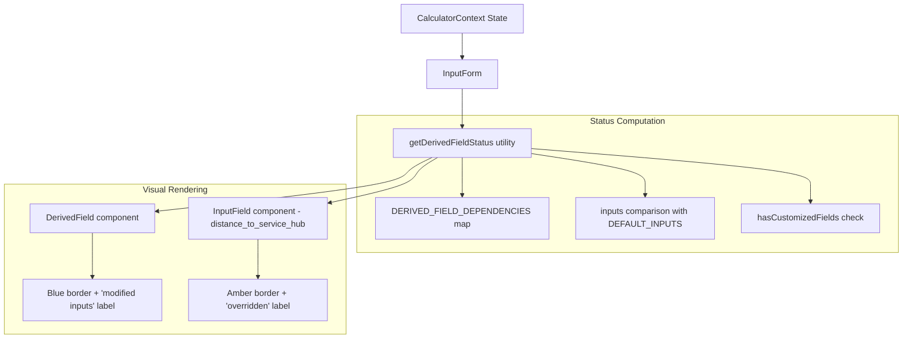

# Design Document: Derived Field Indicators

## Overview

This feature adds a visual indicator system to derived (computed) fields in the Cleaning Robot Fleet Calculator. The system communicates two distinct states:

1. **Non-Default Parents (Blue)**: A derived field's parent inputs have been changed from their defaults, meaning the computed value reflects user customisation.
2. **Overridden (Amber)**: A field that normally auto-calculates has been manually overwritten by the user (applies to `distance_to_service_hub`).

The implementation is a pure utility function (`getDerivedFieldStatus`) that computes indicator state from current inputs, a dependency map constant, and the existing `hasCustomizedFields` set. The UI components (`DerivedField`, `InputField`) receive the computed status as a prop and render the appropriate visual indicator.

## Architecture



The architecture follows the existing pattern: state lives in `CalculatorContext`, computation happens in a pure utility, and components receive computed values as props. No new state is introduced — indicator status is derived from existing state on each render.

## Components and Interfaces

### New: `derivedFieldStatus.ts` utility

```typescript
// src/components/InputForm/derivedFieldStatus.ts

export type DerivedFieldStatus = 'default' | 'non-default-parents' | 'overridden';

export const DERIVED_FIELD_DEPENDENCIES: Record<string, string[]> = {
  travel_time_to_service_hub: ['distance_to_service_hub', 'effective_speed'],
  charging_contention_time: ['num_of_robots', 'num_of_charging_points', 'effective_charge_time'],
  refill_contention_time: ['num_of_robots', 'num_of_refill_stations', 'refill_duration'],
  num_of_recharge_cycles: ['total_battery_life', 'battery_reserve_threshold', 'actual_area_per_floor', 'num_of_floors', 'num_of_passes', 'effective_cleaning_width', 'overlap_percentage', 'effective_speed', 'num_of_robots'],
  num_of_refill_cycles: ['tank_capacity_time', 'actual_area_per_floor', 'num_of_floors', 'num_of_passes', 'effective_cleaning_width', 'overlap_percentage', 'effective_speed', 'num_of_robots'],
};

export function getDerivedFieldStatus(
  fieldName: string,
  inputs: Record<string, unknown>,
  hasCustomizedFields: Set<string>,
  defaultInputs: Record<string, unknown>
): DerivedFieldStatus;
```

**Logic:**
1. If `fieldName` is `'distance_to_service_hub'` and it's in `hasCustomizedFields`, return `'overridden'`.
2. Look up `DERIVED_FIELD_DEPENDENCIES[fieldName]`.
3. For each parent dependency, compare `inputs[parent]` to `defaultInputs[parent]`.
   - Special case: if parent is `distance_to_service_hub` and it's NOT in `hasCustomizedFields`, compare the current dynamic value against the static default (i.e., check if `actual_area_per_floor` differs from its default, which causes the dynamic default to differ).
4. If any parent differs from its default, return `'non-default-parents'`.
5. Otherwise return `'default'`.

### Modified: `DerivedField` component

```typescript
interface DerivedFieldProps {
  label: string;
  value: number | null;
  unit: string;
  tooltip: string;
  note?: string;
  decimals?: number;
  indicatorStatus?: DerivedFieldStatus; // NEW
}
```

When `indicatorStatus === 'non-default-parents'`, the component renders:
- A blue left border on the value row
- A text badge "(modified inputs)" for accessibility

### Modified: `InputField` component

For `distance_to_service_hub` specifically, when `indicatorStatus === 'overridden'`:
- An amber left border on the input row
- A text badge "(overridden)" for accessibility

```typescript
interface InputFieldProps {
  // ... existing props
  indicatorStatus?: DerivedFieldStatus; // NEW - only used for distance_to_service_hub
}
```

### Modified: `InputForm` component

Computes `getDerivedFieldStatus` for each derived field and passes the result as `indicatorStatus` prop. Also computes the override status for `distance_to_service_hub`.

## Data Models

No new data models are introduced. The feature uses existing state:

- `inputs: CalculatorInputs` — current field values
- `hasCustomizedFields: Set<string>` — tracks which fields the user has modified
- `DEFAULT_INPUTS: CalculatorInputs` — static default values

The only new data structure is the `DERIVED_FIELD_DEPENDENCIES` constant (a `Record<string, string[]>`) and the `DerivedFieldStatus` type alias.

## Correctness Properties

*A property is a characteristic or behavior that should hold true across all valid executions of a system — essentially, a formal statement about what the system should do. Properties serve as the bridge between human-readable specifications and machine-verifiable correctness guarantees.*

### Property 1: Non-default parent detection

*For any* derived field and *for any* set of input values, `getDerivedFieldStatus` returns `'non-default-parents'` if and only if at least one parent input (as defined in `DERIVED_FIELD_DEPENDENCIES`) has a value different from its corresponding value in `DEFAULT_INPUTS`.

**Validates: Requirements 1.1, 1.2, 1.3**

### Property 2: Override detection for distance_to_service_hub

*For any* input state, `getDerivedFieldStatus('distance_to_service_hub', inputs, hasCustomizedFields, DEFAULT_INPUTS)` returns `'overridden'` if and only if `'distance_to_service_hub'` is present in `hasCustomizedFields`.

**Validates: Requirements 2.1, 2.2**

### Property 3: Dynamic default awareness

*For any* value of `actual_area_per_floor` that differs from `DEFAULT_INPUTS.actual_area_per_floor`, when `distance_to_service_hub` is NOT in `hasCustomizedFields`, `getDerivedFieldStatus('travel_time_to_service_hub', ...)` shall return `'non-default-parents'` (because the dynamic default for `distance_to_service_hub` differs from the static default). Conversely, when `actual_area_per_floor` equals its default and all other parents of `travel_time_to_service_hub` are at defaults, the status shall be `'default'`.

**Validates: Requirements 4.2, 6.1, 6.2**

### Property 4: Static default comparison when distance is overridden

*For any* manually overridden value of `distance_to_service_hub` (i.e., it is in `hasCustomizedFields`), the non-default-parents evaluation for `travel_time_to_service_hub` shall compare the overridden value against the static `DEFAULT_INPUTS.distance_to_service_hub`, not against the dynamic default.

**Validates: Requirements 6.3**

## Error Handling

This feature has minimal error surface:

- **Missing dependency mapping**: If `getDerivedFieldStatus` is called with a `fieldName` not in `DERIVED_FIELD_DEPENDENCIES` and not `'distance_to_service_hub'`, it returns `'default'` (no indicator).
- **Undefined input values**: If an input value is `undefined` or `null`, it is treated as different from the default (triggering the indicator). This is a safe default since missing values indicate an unusual state.
- **Invalid field names**: The function gracefully returns `'default'` for unknown fields rather than throwing.

## Testing Strategy

### Property-Based Tests (using `fast-check`)

Each correctness property maps to a property-based test with minimum 100 iterations:

1. **Property 1**: Generate random input objects where a random subset of parent fields differ from defaults. Assert that `getDerivedFieldStatus` returns `'non-default-parents'` iff at least one parent differs.
2. **Property 2**: Generate random hasCustomizedFields sets. Assert override detection matches set membership.
3. **Property 3**: Generate random `actual_area_per_floor` values. Assert dynamic default awareness works correctly.
4. **Property 4**: Generate random override values for `distance_to_service_hub`. Assert static comparison is used.

Configuration:
- Library: `fast-check` (already in devDependencies)
- Minimum iterations: 100 per property
- Tag format: `Feature: derived-field-indicators, Property {N}: {title}`

### Unit Tests (example-based)

- Verify `DERIVED_FIELD_DEPENDENCIES` contains the exact expected mappings (Req 1.4)
- Verify form reset clears all indicators (Req 4.3)
- Verify CSS classes are applied correctly for each status (Req 3.1, 3.2)
- Verify accessibility text labels are rendered (Req 3.4)

### Integration Tests

- Verify localStorage load triggers correct indicators (Req 5.1)
- Verify spreadsheet import triggers correct indicators (Req 5.2)
