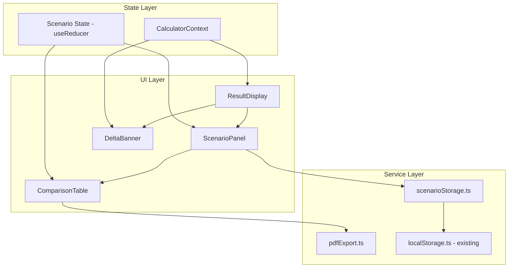

# Design Document: Scenario Comparison & What-Changed Delta Banner

## Overview

This feature adds two capabilities to the Cleaning Robot Fleet Calculator:

1. **Scenario Comparison** — Users can save named snapshots of their inputs + results, view them as cards, select 2–4 for side-by-side comparison in a table, and export the comparison as a PDF.
2. **What-Changed Delta Banner** — After recalculation, a transient banner shows how key metrics changed compared to the previous result, using green/red color coding.

Both features build on the existing `CalculatorContext` state management, `localStorage` service, and `pdfExport` service. The delta banner is ephemeral (React state only), while scenarios are persisted in localStorage under a dedicated key.

## Architecture



### Design Decisions

1. **Separate scenario state from CalculatorContext**: Scenarios are managed via a dedicated `useReducer` hook in a `ScenarioProvider` rather than adding complexity to the existing `CalculatorContext`. This keeps concerns separated — calculator state handles computation, scenario state handles persistence and comparison selection.

2. **Dedicated localStorage key**: Scenarios use `cleaning-robot-fleet-scenarios` key, completely independent of the existing `cleaning-robot-fleet-calculator-inputs` key used for input persistence.

3. **Delta banner in component state**: The previous result is stored in a `useRef` inside `ResultDisplay`. It is never persisted, satisfying the transient requirement. On page reload, no previous result exists, so no banner shows.

4. **Comparison PDF as separate function**: A new `generateComparisonPDF` function in `pdfExport.ts` handles the comparison table export, distinct from the existing single-scenario `generatePDF`.

## Components and Interfaces

### New Components

#### `ScenarioPanel` (`src/components/ScenarioPanel/ScenarioPanel.tsx`)
- Renders the list of saved scenario cards
- Manages selection state (checkboxes) for comparison
- Provides Save, Load, Delete actions
- Shows placeholder when no scenarios exist
- Disables save when limit (20) reached or no result available

#### `ComparisonTable` (`src/components/ComparisonTable/ComparisonTable.tsx`)
- Renders selected scenarios (2–4) as columns in a table
- Rows: calculation mode, start mode, work assignment mode, number of robots, total elapsed time, dead time minutes, dead time percentage, active cleaning percentage
- Highlights best value per numeric row (lowest for time/dead-time, highest for active cleaning %)
- Shows "Export Comparison" button
- Shows warning message if >4 selected

#### `DeltaBanner` (`src/components/DeltaBanner/DeltaBanner.tsx`)
- Displays metric deltas between previous and current result
- Green for improvements (less time, fewer robots, less dead time)
- Red for degradation (more time, more robots, more dead time)
- Shows "Mode changed — comparison not applicable" when modes differ
- Dismissible via close button
- Excluded from PDF exports (not rendered inside PDF-captured DOM)

### Modified Components

#### `ResultDisplay` (`src/components/ResultDisplay/ResultDisplay.tsx`)
- Adds "Save Scenario" button (disabled when no result or limit reached)
- Renders `DeltaBanner` above results (stores previous result in `useRef`)
- Renders `ScenarioPanel` below results

#### `CalculatorContext` (`src/state/CalculatorContext.tsx`)
- Adds `LOAD_SCENARIO` action to restore inputs from a saved scenario
- Clears current result when a scenario is loaded (user must recalculate)

### New Services

#### `scenarioStorage.ts` (`src/services/scenarioStorage.ts`)
- `getScenarios(): SavedScenario[]` — Load all scenarios from localStorage
- `saveScenario(scenario: SavedScenario): { success: boolean; error?: string }` — Persist a new scenario
- `deleteScenario(id: string): void` — Remove a scenario by ID
- `isAtLimit(): boolean` — Check if 20 scenarios reached

### Modified Services

#### `pdfExport.ts` (`src/services/pdfExport.ts`)
- Adds `generateComparisonPDF(scenarios: SavedScenario[]): Blob` — Generates a PDF with the comparison table

## Data Models

### `SavedScenario`

```typescript
interface SavedScenario {
  id: string;              // crypto.randomUUID()
  name: string;            // user-provided name
  savedAt: string;         // ISO 8601 timestamp
  inputs: CalculatorInputs;
  result: CalculationResult;
}
```

### `ScenarioState`

```typescript
interface ScenarioState {
  scenarios: SavedScenario[];
  selectedIds: Set<string>;  // IDs selected for comparison
}
```

### `ScenarioAction`

```typescript
type ScenarioAction =
  | { type: 'LOAD_SCENARIOS'; scenarios: SavedScenario[] }
  | { type: 'ADD_SCENARIO'; scenario: SavedScenario }
  | { type: 'DELETE_SCENARIO'; id: string }
  | { type: 'TOGGLE_SELECTION'; id: string }
  | { type: 'CLEAR_SELECTION' };
```

### `DeltaMetrics`

```typescript
interface DeltaMetrics {
  modeChanged: boolean;
  totalElapsedTime?: { old: number; new: number; delta: number; pctChange: number };
  numRobots?: { old: number; new: number; delta: number };
  deadTimeMinutes?: { old: number; new: number; delta: number; pctChange: number };
}
```

### localStorage Schema

```json
{
  "key": "cleaning-robot-fleet-scenarios",
  "value": [
    {
      "id": "uuid-string",
      "name": "Scenario A",
      "savedAt": "2024-01-15T10:30:00.000Z",
      "inputs": { /* CalculatorInputs */ },
      "result": { /* CalculationResult */ }
    }
  ]
}
```


## Correctness Properties

*A property is a characteristic or behavior that should hold true across all valid executions of a system — essentially, a formal statement about what the system should do. Properties serve as the bridge between human-readable specifications and machine-verifiable correctness guarantees.*

### Property 1: Scenario persistence round-trip

*For any* valid SavedScenario object (with arbitrary name, CalculatorInputs, and CalculationResult), saving it via `saveScenario` and then loading all scenarios via `getScenarios` SHALL return a list containing a scenario with identical `name`, `inputs`, and `result` fields.

**Validates: Requirements 1.2, 2.1, 2.2**

### Property 2: Maximum scenario count invariant

*For any* sequence of save operations (regardless of how many are attempted), the number of scenarios returned by `getScenarios` SHALL never exceed 20.

**Validates: Requirements 1.4**

### Property 3: Corrupted data recovery

*For any* arbitrary string stored under the scenarios localStorage key that is not a valid JSON array of SavedScenario objects, calling `getScenarios` SHALL return an empty array without throwing.

**Validates: Requirements 2.3**

### Property 4: Delete removes exactly one scenario

*For any* non-empty list of saved scenarios and any scenario ID present in that list, calling `deleteScenario(id)` SHALL result in the list length decreasing by exactly one and the deleted ID no longer appearing in the list.

**Validates: Requirements 5.1**

### Property 5: Best-value highlighting selects correct index

*For any* array of 2–4 numeric values, the best-value function SHALL return the index of the minimum value for time-based metrics (elapsed time, dead time minutes, dead time percentage) and the index of the maximum value for active cleaning percentage.

**Validates: Requirements 6.3**

### Property 6: Delta computation correctness

*For any* two valid CalculationResults with the same calculation mode, the computed delta for each metric SHALL equal `newValue - oldValue`, the percentage change SHALL equal `(newValue - oldValue) / oldValue * 100`, and the color assignment SHALL be green when the delta represents improvement (negative for time/dead-time, negative for robot count) and red when it represents degradation (positive for those metrics).

**Validates: Requirements 8.1, 8.2, 8.3, 8.4**

## Error Handling

### Scenario Storage Errors

| Error Condition | Handling Strategy |
|---|---|
| localStorage quota exceeded on save | Return `{ success: false, error: "Storage quota exceeded..." }`, display error toast to user |
| localStorage unavailable (private browsing) | Catch on first access, show persistent warning that scenarios won't persist |
| Corrupted JSON in localStorage | Discard data, return empty array, log warning to console |
| Scenario name is empty/whitespace-only | Prevent save, keep dialog open with validation message |
| Attempt to save when at 20-scenario limit | Disable save button, show "Limit reached" message |

### Delta Banner Errors

| Error Condition | Handling Strategy |
|---|---|
| Previous result has different mode | Show "Mode changed — comparison not applicable" message |
| Division by zero in percentage change (old value is 0) | Display absolute change only, omit percentage |
| Previous result is null (first calculation) | Do not render banner |

### Comparison Table Errors

| Error Condition | Handling Strategy |
|---|---|
| Selected scenario deleted by another action | Remove from selection, re-evaluate if table should still show |
| PDF generation fails | Catch error, show toast with failure message |
| More than 4 scenarios selected | Show warning message, do not render table |

## Testing Strategy

### Unit Tests (Example-Based)

- **ScenarioPanel**: Renders cards, shows placeholder when empty, disables save at limit
- **ComparisonTable**: Renders correct columns for 2–4 scenarios, hides when <2 selected, shows warning when >5
- **DeltaBanner**: Shows/hides correctly, dismiss works, mode-change message displays
- **scenarioStorage**: Error cases (quota exceeded, corrupted data, empty name validation)
- **pdfExport**: `generateComparisonPDF` returns a non-empty Blob

### Property-Based Tests (fast-check)

The project already has `fast-check` installed. Each property test will run a minimum of 100 iterations.

| Property | Test File | What It Validates |
|---|---|---|
| Property 1: Round-trip | `src/services/__tests__/scenarioStorage.property.test.ts` | Save → load preserves all fields |
| Property 2: Max count | `src/services/__tests__/scenarioStorage.property.test.ts` | Never exceeds 20 scenarios |
| Property 3: Corrupted recovery | `src/services/__tests__/scenarioStorage.property.test.ts` | Arbitrary strings → empty array |
| Property 4: Delete correctness | `src/services/__tests__/scenarioStorage.property.test.ts` | Removes exactly one, ID gone |
| Property 5: Best-value | `src/components/ComparisonTable/__tests__/bestValue.property.test.ts` | Correct min/max index selection |
| Property 6: Delta computation | `src/components/DeltaBanner/__tests__/deltaComputation.property.test.ts` | Correct deltas, colors |

**Tag format**: Each property test will include a comment:
```typescript
// Feature: scenario-comparison, Property N: <property text>
```

### Integration Tests

- Full flow: save scenario → appears in list → select 2 → comparison table renders → export PDF
- Load scenario → inputs restored → result cleared
- Delete scenario while selected → removed from comparison

### Test Configuration

- Property tests: minimum 100 iterations per property (fast-check default `numRuns: 100`)
- Unit tests: vitest with jsdom environment
- All tests run via `npm test` (vitest --run)
